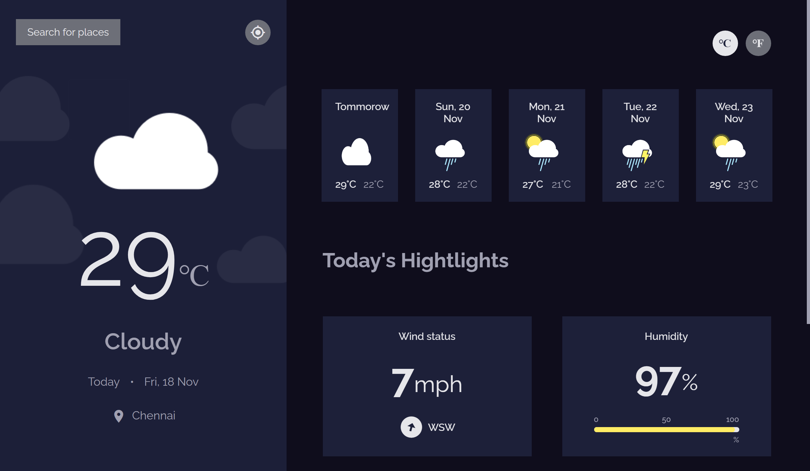

<!-- Please update value in the {}  -->

<h1 align="center">DevChallenges - Weather App</h1>

   Solution for a challenge from  <a href="http://devchallenges.io" target="_blank">Devchallenges.io</a>.

  <h3>
    <a href="https://precious-gaufre-35efdc.netlify.app/">
      Demo
    </a>
     | 
    <a href="https://github.com/shakthi2003gh/DevChallenges-WeatherApp.git">
      Solution
    </a>
     | 
    <a href="https://devchallenges.io/challenges/mM1UIenRhK808W8qmLWv">
      Challenge
    </a>
  </h3>

<!-- TABLE OF CONTENTS -->

## Table of Contents

- [Overview](#overview)
  - [Built With](#built-with)
- [Features](#features)

<!-- OVERVIEW -->

## Overview

### Built With

<!-- This section should list any major frameworks that you built your project using. Here are a few examples.-->

- [Foreca Weather](https://rapidapi.com/foreca-ltd-foreca-ltd-default/api/foreca-weather/)
- [React](https://reactjs.org/)
- [SCSS](https://sass-lang.com/)

## Features

<!-- List the features of your application or follow the template. Don't share the figma file here :) -->

This application/site was created as a submission to a [DevChallenges](https://devchallenges.io/challenges) challenge. The [challenge](https://devchallenges.io/challenges/mM1UIenRhK808W8qmLWv) was to build an application to complete the given user stories.
